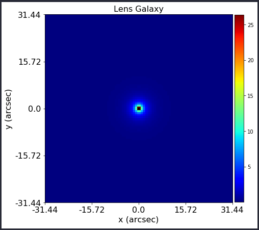
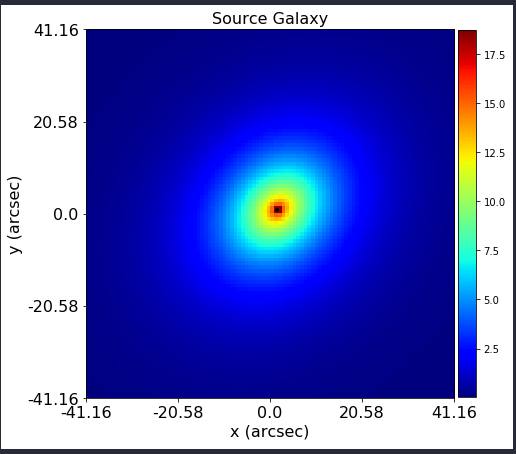
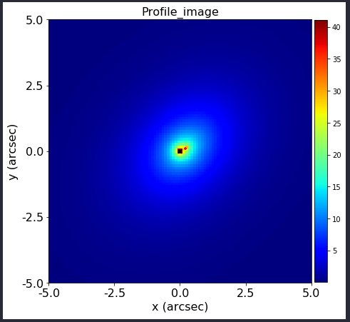
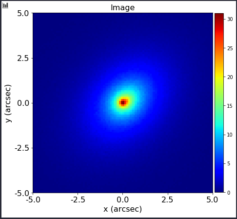
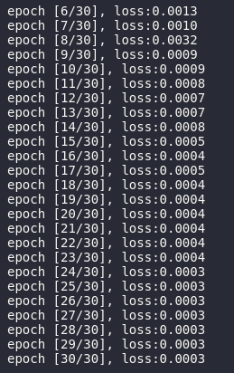
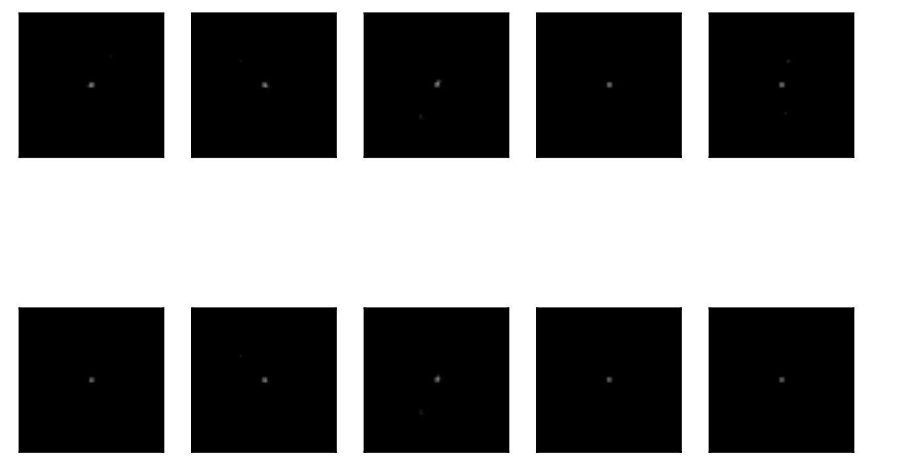

# Task 1

## Description: 
 Modify and/or use the already existing functionality of PyAutoLens to
simulate strong lensing from superfluid dark matter. Specifically, you will need to
simulate the effects of lensing from a linear mass density - imagine this being a string of
mass on galactic scales.

## Implementation

To perform the simulation the Poin-Spread Function as a Gaussian and a uniform grid were used. 

The setup for the lens and source galaxy is the following: 

- source's buldge: SpericalDevVaucoulers function as light profile 
- source's disk: EllipticalExponential function as light profile.
- lens' light: SphericalSersic function as light profile
- lens' mass: SpericalNFW function as its mass profile.
- lens' shear: ExternalShear. 

To order the galaxies in ascending redshift and to create planes for each redshift with the corresponding galaxies, a tracer from the ray-tracing module was used. 

To ensure edge-effects do not affect the simulation's PSF convolution, an imagine generated from padding the original image will be utilized instead. 

The last steps consist of passing the tracer and the grid to the simulate function. By doing so, the telescope optics, the background sky and the poison noises are added. 

## Images

# Task 2

## Description
Using a deep learning algorithm of your choice learn the representation of dark
matter in the strong gravitational lensing images provided using PyTorch.
The goal is to use this learned representation for anomaly detection, hence you should
pick the most appropriate algorithm and discuss your strategy.
## Implementation

Image changes:
- resize them to (148,148)
- normalize them in the [-1,1] range
- convert them from numpy images to torch images

To solve the anomaly detection problem in the given dataset, I used a convolutional neural network with an autoencoder. 

The model has two stages: 
1. the images are encoded for learning purposes, 
2. the images are decoded for reconstruction. 

The main idea of an autoencoder in the anomaly detection problem is to reconstruct the initial image and calculate the corresponding error. 

For the encoder, the following implementation was used:
-  a sequential container 
-  Conv2d as the convolutional layers,
-  ReLU as the activation functions
-  MaxPool2d as dimensionality reduction layers. 

For the decoder, the above statements were reverted, using:
-  ConvTranspose2d as the "deconvolution" function,
-  ReLU as activation function 
-  the Tanh function was applied at the output.

For the training part:
- mean squared error as the loss function.
- Adam as the optimizer with standard model parameters, learning rate of 1e-3 and weight decay of 1e-5.  

## Images

